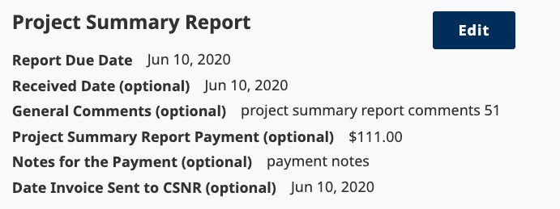
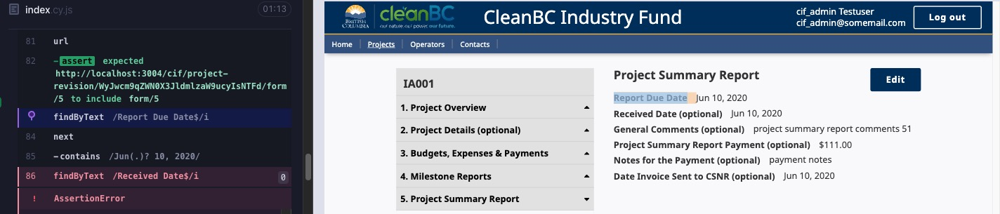
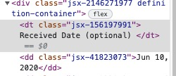
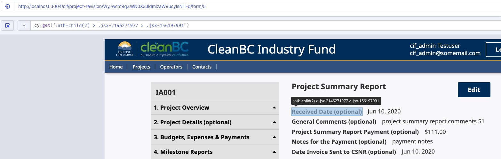

# Finding Text Elements Using Cypress

Our project uses [CypressTesting Library](https://testing-library.com/docs/cypress-testing-library/intro/), which extends cypress commands to allow dom-testing queries like `findByText()` in Cypress end-to-end browser tests.

I have a new component that renders text



And I want to use [Cypress](https://www.cypress.io/) end-to-end (e2e) testing framework to verify that the component is displaying the correct information.

## Cypress Testing Library findByText()

After rendering the page in a cypress e2e test, I write a test like the following

```js
    cy.findByText(/Report Due Date/i)
        .next()
        .contains(reportDueDate);
```
This test ensures that the component renders the due date title and the due date that is passed to it. Then I move on to write subsequent naive tests for the other fields

```js
if (receivedDate) {
     cy.findByText("Received Date")
       .next()
       .contains(receivedDate);
   }
```

However cypress is not able to find this element.



So I think, oh that’s because it has (optional) beside it

```js
cy.findByText(/Received Date (optional)/i)
```
The error persists. I start reading the [testing library docs cheatsheet](https://testing-library.com/docs/dom-testing-library/cheatsheet/#queries),

`cy.findByText(/Received Date (optional)/i)` is using Regex to look for a substring match and ignoring case. Which still throws an error which is very confusing because the string should match? I inspect the page and check what the text is in the element



Another possible syntax is `^text$` for a full-string match so I try it with and without a trailing space
```js
cy.findByText(/^Received Date (optional) $/i)
```
```js

cy.findByText(/^Received Date (optional) $/i)
```
The error persists and I am entirely confused as to why this doesn't work. I finally try
```js
cy.findByText(/Received Date/i)
```
which is able to find the text.

## Built-in Cypress Commands

Wholly confused by the above results, I dig into the built-in cypress commands wondering if the testing library extensions are necessary (they aren't).

I use the target selector (icon to the left of the url)

and get the gross looking query
```js
cy.get(':nth-child(2) > .jsx-2146271977 > .jsx-156197991')
```
Which works. But even simpler and cleaner is
```js
cy.contains("Received Date")
```
which works just as well... -_-

## Takeaways
1. [cy.contains gets only one DOM element](https://dev.to/walmyrlimaesilv/a-simple-cypress-exercise-2lfe). Use `get()` and chain commands like `.first()` if multiple elements may match the query
1. We have lots of code written like
    ```js
    cy.findByLabelText(/Funding Stream$/i).should("be.visible")
    ```
    that I don’t think is doing what I think the author is intending it to do
1. Use built in cypress commands when possible. In the future I will be using ‘contains’ instead of ‘getByText’


